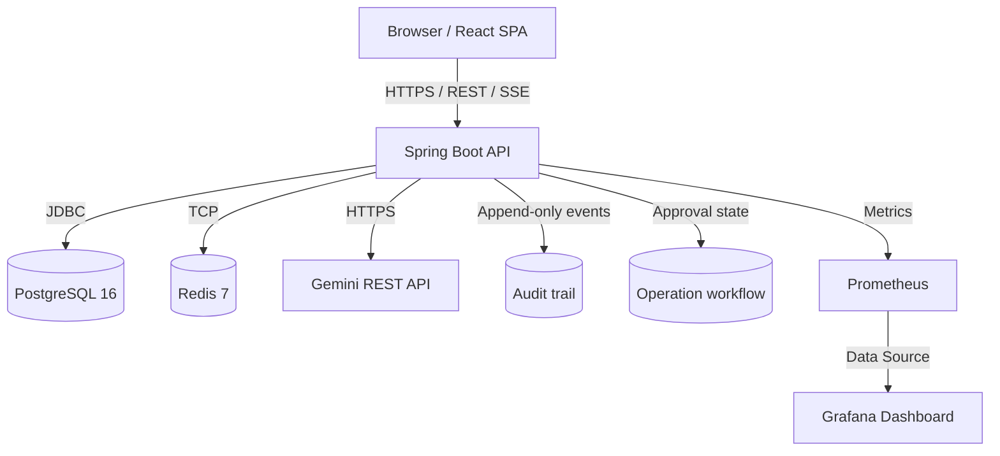
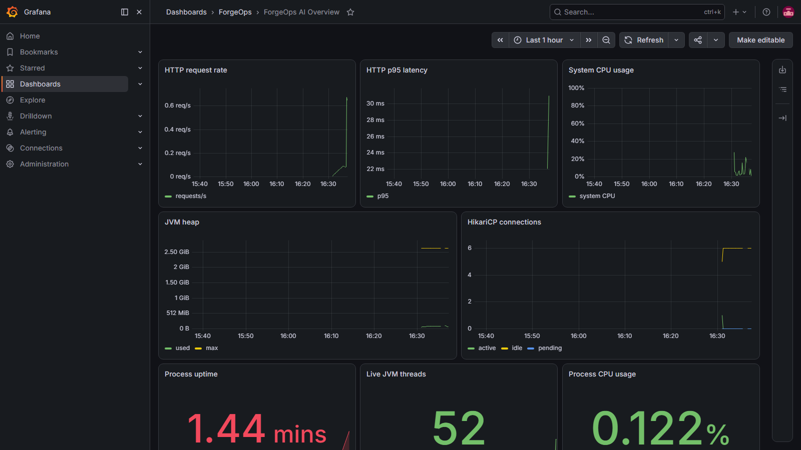

# ForgeOps-AI

ForgeOps-AI is a full-stack DevOps decision-support platform for infrastructure-as-code generation, log analysis, and shell-command safety review. It provides reviewable recommendations; it does not autonomously run AI-generated commands or deploy infrastructure.

## Overview

ForgeOps-AI serves as an operational hub for DevOps and Platform Engineering teams. The system provides a centralized interface for infrastructure provisioning workflows, incident diagnosis, and real-time environment monitoring. The core functionality integrates a Spring Boot backend, a React frontend, and language models to analyze telemetry, generate secure deployment pipelines, and validate administrative shell commands prior to execution.

Intended users include DevOps engineers, system administrators, and site reliability engineers (SREs).

The screenshots below are original captures of the application, CI pipeline, and demo deployment.

## Contents

- [Capabilities](#capabilities)
- [Architecture](#system-architecture)
- [Product tour](#product-tour)
- [Local setup](#local-setup)
- [Validation](#validation)
- [Delivery and deployment](#delivery-and-deployment)
- [Security](#security)

## Capabilities

| Area | What it provides |
| --- | --- |
| Infrastructure generation | Reviewable Terraform, Kubernetes, Helm, Dockerfile, GitHub Actions, and GitLab CI templates. |
| Incident diagnostics | Analysis workflows for Jenkins, Docker, and Kubernetes logs with retained RCA history. |
| Command safety | Shell-command risk assessment, approval records, and idempotent external-execution handoffs. |
| Governance | Server-side RBAC, append-only audit events, correlation IDs, and human approval for medium/high-risk recommendations. |
| Observability | JVM, HikariCP, Redis, PostgreSQL, and AI-integration metrics through Prometheus and Grafana. |
| Identity and access | JWT access tokens, rotating refresh tokens, server-side logout, and role-based access control. |
| Operator experience | Responsive dark-mode workspace with shared design-system components and environment status. |

## System Architecture

The system follows a standard three-tier architecture augmented with an external language model integration. The frontend communicates with the backend via REST over HTTPS, utilizing Server-Sent Events (SSE) for streaming operations. The backend handles business logic, security validation, and orchestrates downstream calls to PostgreSQL (relational data), Redis (caching), and the Gemini API (inference).



## Tech Stack

### Frontend
- React 18
- TypeScript
- Vite 8
- Tailwind CSS 4

### Backend
- Java 21
- Spring Boot 4.1
- Spring Security
- JPA / Hibernate
- Flyway

### Database & Caching
- PostgreSQL 16
- Redis 7
- HikariCP

### AI/ML
- Gemini 3.8 Flash (REST API integration)

### DevOps & Infrastructure
- Docker & Docker Compose
- Kubernetes & Kustomize

### Testing
- JUnit 5 & Mockito
- Testcontainers
- Vitest
- Playwright
- k6

### Monitoring
- Prometheus
- Grafana

## Project Structure

```text
forgeOps-AI/
├── backend/                 # Spring Boot application, flyway migrations, and backend tests
├── frontend/                # React SPA, UI components, and E2E tests
├── infra/
│   ├── docker/              # Docker Compose configuration and environment templates
│   ├── k8s/                 # Kustomize base for Kubernetes deployment
│   └── observability/       # Prometheus and Grafana provisioning definitions
├── tests/
│   └── load/                # k6 load testing scripts and scenarios
├── .github/workflows/       # GitHub Actions CI/CD pipelines
└── .gitlab-ci.yml           # GitLab CI/CD pipeline definition
```

## How It Works

1. **User Authentication**: The client authenticates via the `/api/auth/login` endpoint. A short-lived JWT is issued in memory, while a secure, HttpOnly refresh token is stored in the browser and hashed in PostgreSQL.
2. **Authorization**: Spring Security reloads the account on each JWT-authenticated request and enforces explicit permissions at controller methods. The frontend only mirrors those permissions for usability.
3. **AI processing**: The backend queries Gemini when configured and otherwise uses local rule engines. Provider output is treated as untrusted recommendation text.
4. **Approval and execution boundary**: command recommendations are risk classified. Medium/high-risk operations remain `PENDING_APPROVAL` until a different `APPROVER` or `ADMIN` decides. ForgeOps never invokes a shell. An approved operator can open an idempotent external/manual execution handoff and report its real result.
5. **Traceability**: a correlation ID links recommendation, decision, handoff, result, and audit events. Prometheus exposes request, AI, approval, and execution measurements.

## Product Tour

### Authentication and Operations

| Sign-in | Operations dashboard |
| --- | --- |
|  |  |

### Investigation and Automation

| Log analysis | Generated CI/CD pipeline |
| --- | --- |
|  |  |

### Additional Interfaces

| API playground | Responsive navigation |
| --- | --- |
|  |  |

### Live Observability

The Docker Compose `observability` profile provisions this Grafana dashboard and its Prometheus data source. This capture shows Prometheus scraping the running ForgeOps backend, including HTTP throughput and p95 latency, JVM heap, database-pool activity, uptime, threads, and CPU utilization.



## Local Setup

### Prerequisites

- Java 21
- Maven 3.9+
- Node.js 20+
- npm
- Docker Engine & Docker Compose (for local deployment)
- PostgreSQL 16 (for bare-metal execution)

### Installation

```bash
git clone https://github.com/MayankSinghChouhann/forgeOps-AI.git
cd forgeOps-AI

# Install frontend dependencies
cd frontend
npm ci
cd ..
```

### Environment Configuration

Configuration is managed via environment variables. Create `.env` files based on the provided templates. Never commit populated `.env` files containing actual secrets.

Example configuration keys:

```env
SPRING_DATASOURCE_URL=
SPRING_DATASOURCE_USERNAME=
SPRING_DATASOURCE_PASSWORD=
FORGEOPS_JWT_SECRET=
FORGEOPS_ALLOWED_ORIGINS=
REDIS_PASSWORD=
FORGEOPS_METRICS_PASSWORD=
GRAFANA_ADMIN_PASSWORD=
GEMINI_API_KEY=
FORGEOPS_APPROVAL_TTL=24h
```

### Run Locally

#### Using Docker Compose

```bash
cp infra/docker/.env.example infra/docker/.env
# Populate infra/docker/.env with secure values
docker compose --env-file infra/docker/.env -f infra/docker/docker-compose.yml up --build -d
```

#### Bare-Metal Execution

Backend:
```bash
export SPRING_PROFILES_ACTIVE=dev
export SPRING_DATASOURCE_URL=jdbc:postgresql://localhost:5432/forgeops_db
export SPRING_DATASOURCE_USERNAME=forgeops_user
export SPRING_DATASOURCE_PASSWORD=your_password
export FORGEOPS_JWT_SECRET=your_jwt_secret
mvn -f backend/pom.xml spring-boot:run
```

Frontend:
```bash
cd frontend
cp .env.example .env.local
npm run dev
```

## Validation

### Backend Unit and Integration Tests

The backend utilizes JUnit 5 and Testcontainers for PostgreSQL integration.

```bash
mvn -f backend/pom.xml clean verify
```

### Frontend Tests

The frontend includes unit testing with Vitest and end-to-end testing with Playwright.

```bash
cd frontend
npm run typecheck
npm run lint
npm test
npx playwright install chromium
npm run test:e2e
```

### Load Testing

Load testing is performed via k6 targeting 500 virtual users.

```bash
k6 run -e BASE_URL=http://localhost:8080 -e ACCESS_TOKEN='<jwt>' tests/load/forgeops.js
```

### Build

To compile the production artifacts:

Backend:
```bash
mvn -f backend/pom.xml clean package -DskipTests
```

Frontend:
```bash
cd frontend
npm run build
```

## Delivery and Deployment

### CI/CD Pipelines

The repository includes GitHub Actions (`.github/workflows/ci.yml`) and GitLab CI (`.gitlab-ci.yml`) definitions. Pipelines enforce Trivy vulnerability scanning, ESLint validation, Playwright E2E tests, and Java unit testing prior to container publishing.

The captured GitHub Actions run below shows successful backend tests, frontend checks, repository scanning, container publishing, image scanning, and a completed deployment job. A green deployment job alone does not confirm a cluster rollout: the workflow skips its apply step when cluster credentials are absent.


### Kubernetes

A Kustomize base is provided for Kubernetes deployment. This includes manifests for namespaces, ConfigMaps, Deployments, HorizontalPodAutoscalers (HPA), Services, PodDisruptionBudgets (PDB), NetworkPolicies, and Ingress.

```bash
kubectl apply -k infra/k8s
kubectl -n forgeops rollout status deployment/backend
kubectl -n forgeops rollout status deployment/frontend
```

*Note: For production, externalize the PostgreSQL and Redis instances to managed services and supply credentials via a Kubernetes Secret or native cloud secret manager.*

### One-Time AWS Demo Evidence

The EC2 material below records a one-time, operator-led demo deployment. The Compose screenshot predates the current loopback-only port bindings. This is historical evidence, not a permanent public endpoint; stop the instance after the demonstration to avoid unnecessary AWS charges.


## API Documentation

The REST API documentation is generated automatically via OpenAPI in development. It is disabled by the `prod` profile.

- Swagger UI: `http://localhost:8080/swagger-ui.html`
- OpenAPI JSON: `http://localhost:8080/v3/api-docs`

## Security

- **Authentication**: JWTs are stored in memory. Refresh tokens are persisted as SHA-256 hashes and transmitted via `HttpOnly`, `Secure`, and `SameSite=Strict` cookies.
- **Authorization**: `ADMIN`, `OPERATOR`, `APPROVER`, and `VIEWER` roles map to explicit server-side permissions. New self-registered accounts are least-privilege viewers; an administrator must grant operational access.
- **Approval separation**: requesters cannot approve their own medium/high-risk operation. Pessimistic row locking, expiry, state-transition validation, and idempotency keys prevent duplicate or replayed execution handoffs.
- **Audit**: mutating APIs and domain lifecycle events are written to a searchable audit table. Sensitive metadata keys are redacted before persistence; PostgreSQL rejects audit-row updates and deletes.
- **AI boundary**: model output is never passed to `Runtime.exec`, `ProcessBuilder`, or a shell. The execution handoff is explicitly external/manual.
- **Measured evaluation**: Micrometer records API and AI latency/errors. Database-derived metrics report acceptance/rejection, approval turnaround, execution outcomes, and execution latency; empty datasets return no value rather than invented numbers.
- **Rate Limiting**: Per-IP rate limiting is applied to authentication and LLM invocation endpoints.
- **Dependency Scanning**: Trivy is integrated into the CI/CD pipeline to block deployments of images with HIGH or CRITICAL vulnerabilities.
- **Container Hardening**: Docker images drop unnecessary capabilities, run as non-root users, and enforce read-only filesystems where possible.

The detailed permission matrix, workflow transitions, audit model, metric names, and production limitations are documented in [Security and operations architecture](docs/SECURITY_ARCHITECTURE.md).

## License

Released under the MIT License. See the `LICENSE` file for full text.

## Authors / Maintainers

- Mayank Singh Chouhan
