# ForgeOps AI

[](https://github.com/MayankSinghChouhann/forgeOps-AI/actions/workflows/ci.yml)


ForgeOps AI is a production-oriented DevOps assistant for incident diagnosis,
infrastructure generation, shell-command safety, and platform telemetry. It
combines a Spring Boot API, React SPA, PostgreSQL, Redis, Gemini, Prometheus,
Grafana, Docker Compose, Kubernetes, and enforced CI/CD quality gates.

> **Release status: one-time AWS demo, not a public production launch.** The
> 2026-09-25 release-candidate screenshots below are from the current EC2
> demo. Owner-controlled secret rotation, managed production infrastructure,
> staging evidence, and a live production verification remain outstanding.
> See [Release status](#release-status).

## Contents

- [Capabilities](#capabilities)
- [AWS release-candidate demo](#aws-release-candidate-demo-2026-09-25)
- [Architecture](#architecture)
- [Quick start with Docker](#quick-start-with-docker)
- [Configuration](#configuration)
- [Tests and quality gates](#tests-and-quality-gates)
- [Kubernetes deployment](#kubernetes-deployment)
- [Rollback](#rollback)
- [Release status](#release-status)
- [Implementation PR ledger](#implementation-pr-ledger)

## Capabilities

- JWT registration/login with rotating, SHA-256-at-rest refresh tokens,
  server-side logout, USER/ADMIN roles, and environment-driven CORS.
- AI assistant with persisted sessions, complete conversation context, Gemini
  retry/backoff, structured response parsing, DevOps scope guardrails, local
  fallback knowledge, and SSE response delivery.
- Jenkins, Docker, and Kubernetes log analysis with stored RCA history.
- Terraform, Kubernetes, Helm, Dockerfile, GitHub Actions, and GitLab CI
  generation. Generation occurs only after an explicit user action.
- Shell command generation and explanation with mandatory safety classification.
- Live JVM, HikariCP, PostgreSQL, Redis, Gemini, activity, and platform metrics.
- Paginated history APIs, bounded dashboard queries, Redis dashboard caching,
  input-size limits, RFC 7807 errors, OpenAPI, and structured JSON logs.
- Prometheus scraping with dedicated credentials and an auto-provisioned
  eight-panel Grafana dashboard.
- Enterprise dark-mode frontend with centralized design tokens, responsive
  navigation, compact operational tables, semantic status indicators, and
  accessible authentication and form controls.
- GitHub and GitLab pipelines, Trivy, OWASP ZAP workflow, Playwright, Vitest,
  Testcontainers, and k6 thresholds for 500 virtual users.

## Frontend design system

The ForgeOps interface uses a restrained, operations-focused design system
rather than a terminal theme. Global tokens in `frontend/src/index.css` define
neutral surfaces, borders, typography, one blue interaction accent, and status
colors used only for health and risk. Monospace typography is limited to logs,
commands, generated code, identifiers, and timestamps.

Shared frontend primitives include:

- `PageHeader`, `MetricCard`, and `StatusIndicator` for consistent hierarchy.
- Unified `Button`, `Input`, `Card`, and `Badge` variants with visible keyboard
  focus states.
- A responsive application shell with a 256 px desktop sidebar and an
  accessible mobile drawer.
- A reusable analyzer workspace shared by Jenkins, Docker, and Kubernetes
  diagnostics.
- Structured activity and analysis tables with horizontal overflow containment
  on narrow screens.

The responsive E2E suite checks every primary route and verifies containment at
1440 px, 1366 px, 1024 px, and 390 px viewport widths.

## AWS release-candidate demo (2026-09-25)

These screenshots were captured from the real Docker Compose application on
the existing AWS Mumbai EC2 instance using an encrypted SSH tunnel to
`http://localhost:13000`. The deployed backend and frontend images were both
built from commit `809b5de2ab468e7e01991bdf6fbc81a791dc3f25` and passed
the main-branch image vulnerability gates before deployment. Frontend and API
ports remained bound to EC2 loopback; this was **not a public HTTPS launch**.
The temporary screenshot account used a generated password that is not shown
or stored in this repository. The application's "Production" workspace label
in these images is a UI environment label, not evidence of public exposure or
a 24/7 production deployment.

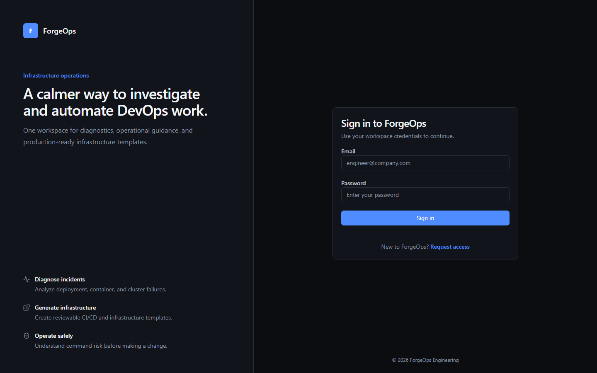

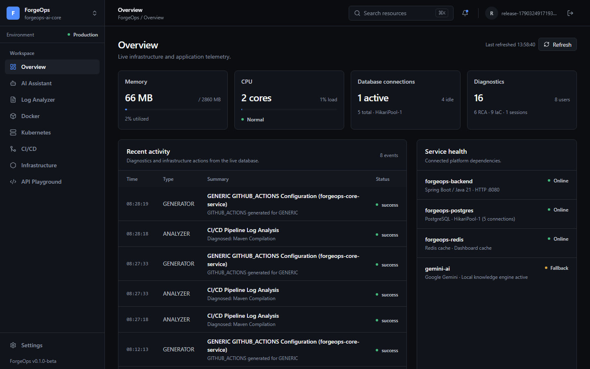

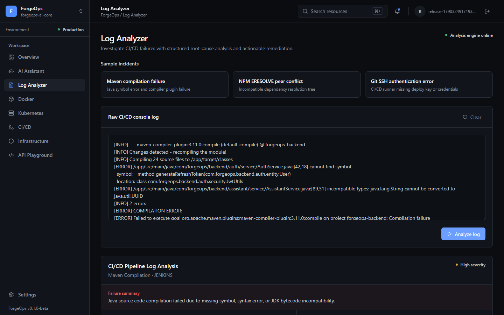

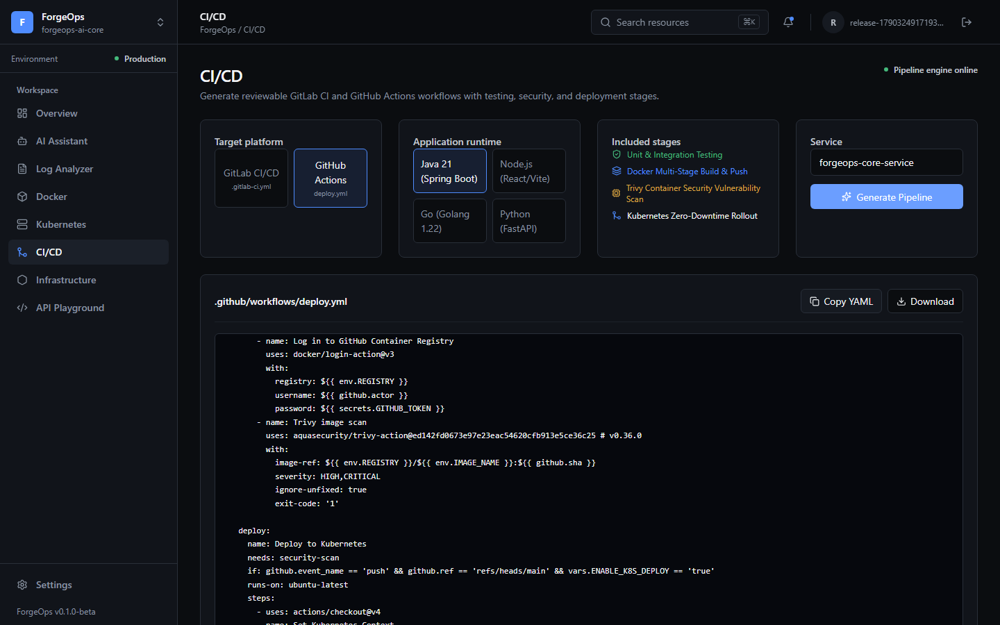

Smoke checks covered sign-in/registration, the authenticated dashboard, log
analysis, CI/CD generation, `/actuator/health/liveness`, and
`/actuator/health/readiness`. The database was backed up before the image
update; Docker volumes were preserved for rollback. None of these checks
replaces staging DAST/load testing, a restore drill, or production TLS checks.

### Screenshot provenance

Every screenshot referenced in this README is a direct capture of the ForgeOps
application, AWS Console, or an operator terminal. No screenshot is AI-generated
or synthetically recreated. Credentials, private-key contents, passwords, and
AWS account identifiers are intentionally excluded from the published evidence.

## Manual AWS provisioning evidence (historical)

These original, unedited operator screenshots from 2026-09-23 and 2026-09-24
show the initial EC2 provisioning path. They are retained for audit chronology,
not as evidence of the current hardened network configuration.

### EC2 instance launch

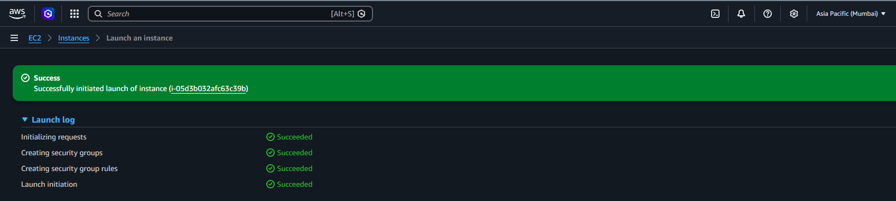

The AWS Console recorded successful request initialization, security-group
creation, rule creation, and instance launch in the Mumbai region.

### SSH access established

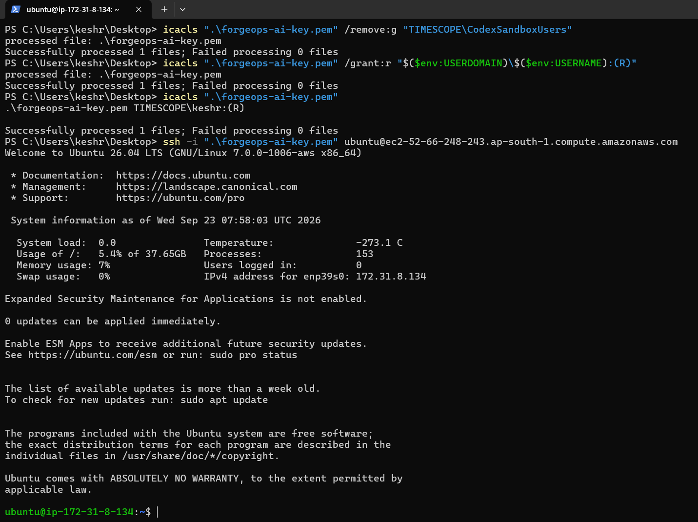

The terminal capture confirms that the PEM file permissions were restricted and
an Ubuntu SSH session was established without exposing the private-key content.

### Initial Compose services

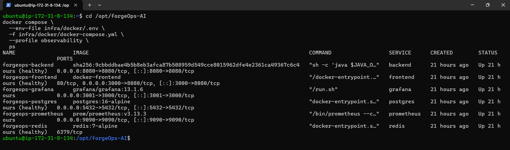

This pre-hardening capture records the original backend, frontend, PostgreSQL,
Redis, Prometheus, and Grafana services. Its public port bindings are historical;
the 2026-09-25 release-candidate deployment binds application and data ports to
EC2 loopback and is accessed through the encrypted SSH tunnel described above.

## AWS application evidence (historical)

The following sanitized screenshots were captured from the one-time Docker
Compose demo environment in AWS Mumbai on 2026-09-24. These are historical UI
evidence from before the latest security/runtime changes, not a current release
smoke test. They contain no login passwords, secrets, private-key material, or
monitoring credentials. This is verification evidence only, not a claim of a
production deployment.

### Live operations overview

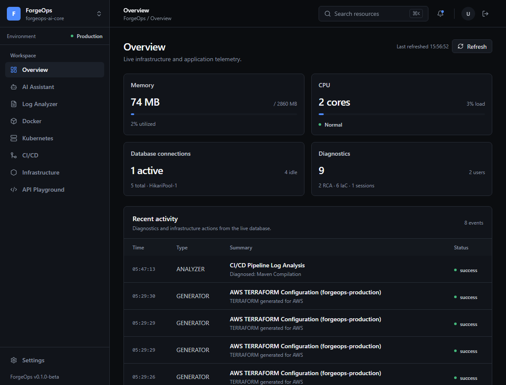

The overview shows live backend telemetry, database-pool status, diagnostics,
and persisted activity from the deployed environment.

### Incident analysis and workflow generation

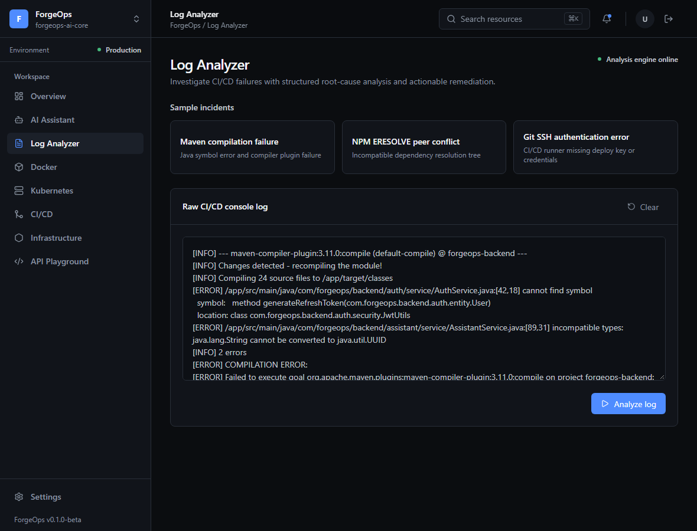

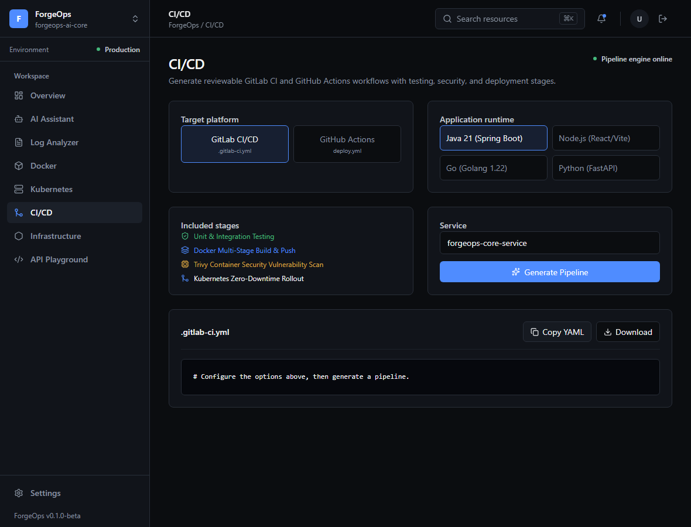

The diagnostic and generation workspaces retain their real API-backed actions
while presenting input, status, and generated output in a reviewable format.

### Infrastructure and API workspaces

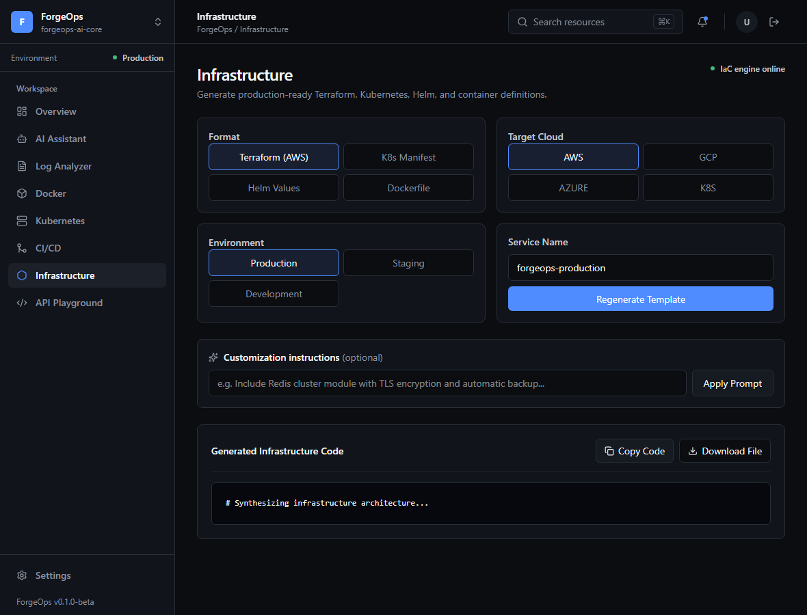

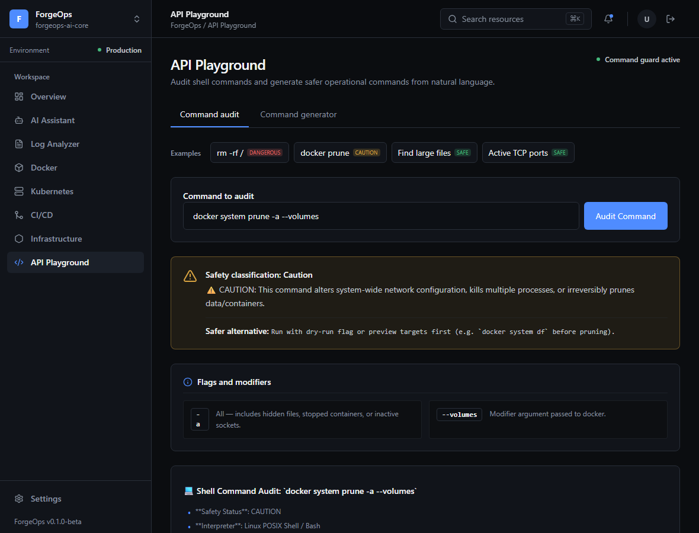

### Responsive navigation

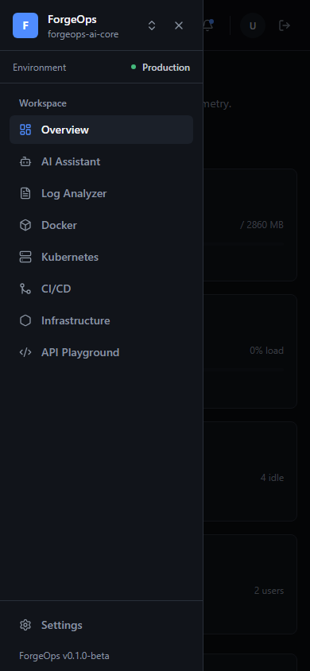

The desktop sidebar becomes an accessible, contained drawer at a 390 px
viewport; the Playwright suite verifies that this layout has no horizontal page
overflow.

## Architecture

```text
Browser / React 18 + Vite 8
            |
            | JWT + JSON / SSE
            v
Spring Boot 4.1 / Java 21
  |-- Auth and RBAC          |-- Log analyzer
  |-- AI assistant          |-- IaC generator
  |-- Shell safety          |-- Dashboard and Actuator
            |
            +---- PostgreSQL 16 (Flyway V1-V8)
            +---- Redis 7 (short-lived dashboard cache)
            +---- Gemini 3.8 Flash (optional; local fallback available)
            +---- Prometheus -> Grafana
```

The backend uses package-by-feature boundaries under `auth`, `assistant`,
`analyzer`, `generator`, `terminal`, and `dashboard`. Production schema changes
are Flyway-only; Hibernate runs with `ddl-auto=validate`.

## Technology

| Layer | Stack |
|---|---|
| Backend | Java 21, Spring Boot 4.1, Spring Security, JPA/Hibernate, Flyway |
| Data | PostgreSQL 16, Redis 7, HikariCP |
| AI | Gemini 3.8 Flash REST API with local fallback |
| Frontend | React 18, TypeScript, Vite 8, Tailwind CSS 4 |
| Testing | JUnit 5, Mockito, MockMvc, Testcontainers, Vitest, Playwright, k6 |
| Operations | Docker Compose, Kubernetes/Kustomize, Prometheus, Grafana |
| Delivery | GitHub Actions, GitLab CI, Trivy, OWASP ZAP |

## Quick start with Docker

Requirements: Docker Desktop with Compose v2 and at least 4 GB of available
memory.

From the repository root:

```powershell
Copy-Item infra/docker/.env.example infra/docker/.env
```

Replace every placeholder in `infra/docker/.env`. Generate fresh secrets rather
than copying sample or historical values:

```bash
openssl rand -base64 48  # FORGEOPS_JWT_SECRET
openssl rand -base64 32  # POSTGRES_PASSWORD
openssl rand -base64 32  # REDIS_PASSWORD
openssl rand -base64 32  # FORGEOPS_METRICS_PASSWORD
openssl rand -base64 32  # GRAFANA_ADMIN_PASSWORD
```

`GEMINI_API_KEY` is optional. Without it, the local expert engine handles
supported DevOps scenarios.

Start the application:

```bash
docker compose --env-file infra/docker/.env \
  -f infra/docker/docker-compose.yml up --build -d
```

Open:

- Frontend: <http://localhost:3000>
- API health: <http://localhost:8080/actuator/health>
- Swagger UI: <http://localhost:8080/swagger-ui.html>

No default application account is created unless bootstrap is explicitly
enabled. Normally, register through the UI. For a one-time admin bootstrap, set
all three values, start once, then disable bootstrap:

```dotenv
FORGEOPS_BOOTSTRAP_ENABLED=true
FORGEOPS_BOOTSTRAP_ADMIN_EMAIL=admin@example.com
FORGEOPS_BOOTSTRAP_ADMIN_PASSWORD=<unique-strong-password>
```

## Local development

Requirements: Java 21, Maven 3.9+, Node.js 20+, npm, and PostgreSQL 16.

Backend:

```bash
export SPRING_PROFILES_ACTIVE=dev
export SPRING_DATASOURCE_URL=jdbc:postgresql://localhost:5432/forgeops_db
export SPRING_DATASOURCE_USERNAME=forgeops_user
export SPRING_DATASOURCE_PASSWORD='<local-password>'
export FORGEOPS_JWT_SECRET="$(openssl rand -base64 48)"
mvn -f backend/pom.xml spring-boot:run
```

On PowerShell, assign the same values through `$env:NAME='value'` before running
Maven.

Frontend:

```bash
cd frontend
cp .env.example .env.local
npm ci
npm run dev
```

`VITE_API_URL=/api` uses the Vite/Nginx same-origin proxy. Set an absolute API
URL only when the frontend and backend are hosted separately, and add that
frontend origin to `FORGEOPS_ALLOWED_ORIGINS`.

## Configuration

| Variable | Required | Purpose |
|---|---:|---|
| `SPRING_DATASOURCE_URL` | yes | PostgreSQL JDBC URL |
| `SPRING_DATASOURCE_USERNAME` | yes | Database user |
| `SPRING_DATASOURCE_PASSWORD` | yes | Database password |
| `FORGEOPS_JWT_SECRET` | yes | Base64-encoded signing secret, 256 bits or stronger |
| `FORGEOPS_ALLOWED_ORIGINS` | yes in prod | Comma-separated trusted browser origins |
| `REDIS_PASSWORD` | when Redis enabled | Redis authentication password |
| `FORGEOPS_REDIS_CACHE_ENABLED` | no | Enables Redis dashboard cache |
| `FORGEOPS_METRICS_PASSWORD` | for Prometheus | Dedicated `/actuator/prometheus` password |
| `GRAFANA_ADMIN_PASSWORD` | with Grafana | Grafana administrator password |
| `GEMINI_API_KEY` | no | Enables remote Gemini responses |
| `GEMINI_MODEL` | no | Defaults to `gemini-3.8-flash` |
| `DB_POOL_MAX_SIZE` / `DB_POOL_MIN_IDLE` | no | Production HikariCP tuning |

The complete Docker-oriented template is `infra/docker/.env.example`. Never
commit a populated `.env` file.

## API and security

| Area | Endpoint |
|---|---|
| Auth | `POST /api/auth/register`, `/login`, `/refresh`, `/logout` |
| Assistant | session CRUD, `POST /api/assistant/chat`, `/chat/stream` |
| Analyzer | `POST /api/analyzer/analyze`, paginated `/history` |
| Generator | `POST /api/generator/generate`, paginated `/history` |
| Terminal | `POST /api/terminal/explain`, `/generate` |
| Dashboard | `GET /api/dashboard/metrics` |
| Docs | `GET /swagger-ui.html`, `/v3/api-docs` |
| Probes | `/actuator/health/liveness`, `/actuator/health/readiness` |
| Metrics | `/actuator/prometheus` with monitoring Basic credentials |

Access JWTs are held in module memory (not persistent browser storage). Rotating
refresh tokens are sent only in a `Secure`, `HttpOnly`, `SameSite=Strict` cookie
in production and stored as SHA-256 hashes in PostgreSQL. The frontend refreshes
proactively before access-token expiry and deduplicates concurrent refreshes
after a 401. The local Compose example intentionally disables the `Secure`
cookie flag for plain-HTTP localhost only; production must set
`FORGEOPS_REFRESH_COOKIE_SECURE=true` and configure the exact HTTPS origin.

Auth and AI mutation routes have per-IP rate limits. This implementation is
in-process, so a multi-replica production deployment should enforce an
additional distributed limit at the ingress/API gateway.
For an AWS public endpoint, add an AWS WAF/API-gateway distributed rate limit;
the application limiter alone is not sufficient when scaling to multiple pods.

## Observability

Start the optional observability profile:

```bash
docker compose --env-file infra/docker/.env \
  -f infra/docker/docker-compose.yml --profile observability up --build -d
```

- Grafana: <http://localhost:3001> (`admin` plus the configured password)
- Prometheus: <http://localhost:9090>
- Dashboard: **ForgeOps / ForgeOps AI Overview**

The dashboard covers HTTP rate and p95 latency, JVM heap, system/process CPU,
HikariCP activity, uptime, and live threads. Prometheus reads its monitoring
password from a Compose secret; application JWT credentials are not reused.

## Tests and quality gates

Backend:

```bash
mvn -f backend/pom.xml clean verify
```

The suite currently contains 70 tests across services, authentication,
controller contracts, OpenAPI, secured metrics, and PostgreSQL/Flyway. The
Testcontainers test skips only when Docker is unavailable; GitHub CI runs it
against a real PostgreSQL container.

Frontend:

```bash
cd frontend
npm ci
npm run typecheck
npm run lint
npm test
npm run build
npx playwright install chromium
npm run test:e2e
npm audit
```

Playwright covers seven journeys: authentication/dashboard, log analysis,
explicit infrastructure generation, shell safety, mobile navigation, every
primary workspace route, and desktop/laptop/tablet viewport containment.

Load test:

```bash
k6 run -e BASE_URL=http://localhost:8080 \
  -e ACCESS_TOKEN='<jwt>' tests/load/forgeops.js
```

The script targets 500 virtual users and fails when configured p95 latency or
error-rate thresholds are exceeded. Run it against an isolated staging system,
not a developer laptop or production without an approved test window.

CI blocks merges on backend verification, frontend lint/typecheck/unit/build/E2E,
and Trivy HIGH/CRITICAL vulnerability, secret, and misconfiguration findings.
OWASP ZAP is available as a manually triggered isolated API scan.

## Kubernetes deployment

The Kustomize base in `infra/k8s` includes namespace, ConfigMap, PostgreSQL,
Redis, backend, frontend, HPA, Services, PDBs, NetworkPolicies, and TLS ingress
resources. Images run as non-root with dropped capabilities, resource
requests/limits, probes, topology spread, and rolling updates. The bundled
PostgreSQL/Redis manifests are a convenience baseline, not production-grade
managed data services or a backup/HA design. Do not use this base as a public
production deployment until the database/cache are moved to managed services,
credentials are supplied through the cloud secret manager, and the ingress/DNS/
TLS values have been replaced. NetworkPolicies require a supporting CNI;
Metrics Server is required for HPA metrics, and the PDBs need multiple healthy
replicas to protect during disruption.

Before deployment:

1. Replace `forgeops.example.com` in the ConfigMap and ingress.
2. Configure the `forgeops-tls` secret and an ingress controller.
3. Create `forgeops-secrets` as documented in `infra/k8s/README.md`.
4. For production, configure managed PostgreSQL/Redis, verified backups, and
   cloud-managed secrets; the included in-cluster data services are not HA.

Validate and apply:

```bash
kubectl kustomize infra/k8s > /dev/null
kubectl apply -k infra/k8s
kubectl -n forgeops rollout status deployment/backend
kubectl -n forgeops rollout status deployment/frontend
```

GitHub deployment is deliberately gated by the `ENABLE_K8S_DEPLOY` repository
variable and `KUBE_CONFIG_B64` environment secret. GitLab uses the equivalent
variables. CI publishes immutable commit-SHA image tags before rollout.

## Rollback

Application rollback:

```bash
kubectl -n forgeops rollout history deployment/backend
kubectl -n forgeops rollout undo deployment/backend
kubectl -n forgeops rollout undo deployment/frontend
```

For an exact version, set both deployments to a previously verified commit-SHA
image tag. Every implementation unit was merged through a dedicated feature PR,
so a Git rollback can also revert one merge commit without mixing unrelated
changes.

Database migrations are forward-only. Take a verified PostgreSQL backup before
release; restore that backup or apply a reviewed compensating migration if a
schema rollback is required. Never delete an applied Flyway migration.

## Secret rotation and history cleanup

Runtime secrets are no longer stored in tracked files, but the original audit
found credentials in older Git history. Treat every historical value as
compromised.

1. Rotate the Gemini key in Google AI Studio and rotate JWT/database/Redis
   credentials in the target secret manager.
2. Confirm applications use only the new values.
3. Schedule a repository maintenance window and freeze pushes.
4. Use `git filter-repo` on a fresh mirror to remove the historical `.env` and
   replace any old inline values, review the rewritten object database, then
   force-push all affected refs.
5. Revoke old credentials again if they were ever used after the rewrite began,
   invalidate open PR branches, and require every contributor to re-clone.

History was intentionally not rewritten automatically during this work because
the operation is destructive, invalidates existing clones/PR SHAs, and conflicts
with the requirement to preserve easy backtracking. Rotation must happen before
history cleanup; rewriting history alone does not revoke a leaked credential.

## Release status

Repository checks and the main-branch scans for the exact immutable backend and
frontend images pass on the latest merged application baseline. This does not
mean the service is ready for public production traffic. The prior audit's
40-task count was recorded before the latest hardening PRs and is not a current
readiness score; no percentage is claimed here.

| Area | Status | Details |
|---|---|---|
| Repository | Implemented | Session-cookie hardening, loopback-safe Compose defaults, image scanning before gated deployment, K8s availability/network policies, and CI validation are merged. |
| Staging | Not verified | No current staging endpoint, DAST/k6 report, backup-restore proof, or rollback drill is attached. |
| Production | Not launched | No approved production architecture/domain/TLS, managed data services, owner-rotated secrets, or live smoke-test evidence is configured. |
| Current demo evidence | One-time EC2 | The 2026-09-25 screenshots above show the verified immutable release-candidate images over a local SSH tunnel, not a public deployment. |
| Historical evidence | Demo only | The 2026-09-23/24 manual provisioning and UI screenshots are kept separately for audit chronology. |

Required before a production launch:

- Choose the AWS target architecture and approve its ongoing costs. The CI
  deployment workflow targets Kubernetes/EKS; the earlier one-time EC2 demo is
  a separate Docker Compose setup. Do not enable the deployment gate until the
  selected path is actually configured.
- Provide the production domain, HTTPS certificate/ingress, network restrictions,
  and health-check routing. For EKS, configure the cluster context and the
  repository's gated `ENABLE_K8S_DEPLOY` / `KUBE_CONFIG_B64` settings.
- Provision managed PostgreSQL and Redis, backup/restore, monitoring/alerts, and
  cloud secret-manager integration; provide only newly rotated secrets through
  the approved secret store, never in Git or chat.
- Rotate credentials that existed before the audit. After rotation, coordinate
  the destructive Git history cleanup described below; it invalidates existing
  clones and PR SHAs, so it must not be done casually.
- Run isolated staging DAST and load tests, verify database restore and app
  rollback, then deploy one immutable SHA and validate TLS, health probes,
  authentication/session refresh, dashboards, and alerts.
- After any future public release, capture fresh sanitized production evidence;
  neither set of demo screenshots proves a production launch.

The one-time EC2 session should be stopped after screenshots are collected.
Confirm the instance state in AWS Console; stopping it does not necessarily stop
charges for attached storage, static IPs, load balancers, or other services.
No new AWS infrastructure was provisioned in this release-candidate work.

## Implementation PR ledger

The project was deliberately split into reviewable, reversible feature branches:

- [#5 — security and schema foundation](https://github.com/MayankSinghChouhann/forgeOps-AI/pull/5)
- [#6 — authentication hardening](https://github.com/MayankSinghChouhann/forgeOps-AI/pull/6)
- [#7 — pagination and dashboard performance](https://github.com/MayankSinghChouhann/forgeOps-AI/pull/7)
- [#8 — AI context, SSE, retry, and safety](https://github.com/MayankSinghChouhann/forgeOps-AI/pull/8)
- [#9 — frontend session and health integration](https://github.com/MayankSinghChouhann/forgeOps-AI/pull/9)
- [#10 — Redis caching and structured observability](https://github.com/MayankSinghChouhann/forgeOps-AI/pull/10)
- [#11 — Kubernetes and CI/CD](https://github.com/MayankSinghChouhann/forgeOps-AI/pull/11)
- [#12 — API documentation and quality gates](https://github.com/MayankSinghChouhann/forgeOps-AI/pull/12)
- [#13 — Gemini 3.8 Flash upgrade](https://github.com/MayankSinghChouhann/forgeOps-AI/pull/13)
- [#14 — secure Prometheus and Grafana dashboard](https://github.com/MayankSinghChouhann/forgeOps-AI/pull/14)
- [#15 — final generator and logging cleanup](https://github.com/MayankSinghChouhann/forgeOps-AI/pull/15)
- [#16 — production operations and release guide](https://github.com/MayankSinghChouhann/forgeOps-AI/pull/16)
- [#17 — non-root Nginx runtime fix](https://github.com/MayankSinghChouhann/forgeOps-AI/pull/17)
- [#18 — enterprise DevOps frontend design system](https://github.com/MayankSinghChouhann/forgeOps-AI/pull/18)
- [#19 — verified AWS demo UI evidence](https://github.com/MayankSinghChouhann/forgeOps-AI/pull/19)
- [#20 — secure refresh-cookie sessions](https://github.com/MayankSinghChouhann/forgeOps-AI/pull/20)
- [#21 — scan release images before deployment](https://github.com/MayankSinghChouhann/forgeOps-AI/pull/21)
- [#22 — production runtime guards and CI validation](https://github.com/MayankSinghChouhann/forgeOps-AI/pull/22)
- [#23 — Kubernetes availability and data network policies](https://github.com/MayankSinghChouhann/forgeOps-AI/pull/23)
- [#24 — release-readiness guide and current demo evidence](https://github.com/MayankSinghChouhann/forgeOps-AI/pull/24)
- [#25 — pin Trivy action for reliable scanning](https://github.com/MayankSinghChouhann/forgeOps-AI/pull/25)
- [#26 — backend image vulnerability remediation](https://github.com/MayankSinghChouhann/forgeOps-AI/pull/26)
- [#27 — immutable Compose image references](https://github.com/MayankSinghChouhann/forgeOps-AI/pull/27)
- [#28 — frontend runtime image remediation](https://github.com/MayankSinghChouhann/forgeOps-AI/pull/28)
- [#29 — unauthenticated Kubernetes health probes](https://github.com/MayankSinghChouhann/forgeOps-AI/pull/29)
- [#30 — fail-closed generated pipeline security gates](https://github.com/MayankSinghChouhann/forgeOps-AI/pull/30)
- [#31 — professional README and original AWS evidence](https://github.com/MayankSinghChouhann/forgeOps-AI/pull/31)

## Repository layout

```text
backend/                 Spring Boot API, migrations, and backend tests
frontend/                React SPA, Vitest, and Playwright journeys
infra/docker/            Docker Compose and environment template
infra/k8s/               Kustomize production base
infra/observability/     Prometheus and Grafana provisioning
tests/load/              k6 load scenario and thresholds
.github/workflows/       CI/CD and manually triggered OWASP ZAP scan
.gitlab-ci.yml            GitLab build, test, scan, package, and deploy pipeline
```

## License

No license file is currently included. Add an explicit license before public
distribution or third-party reuse.
